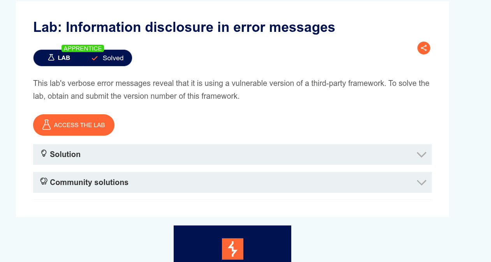
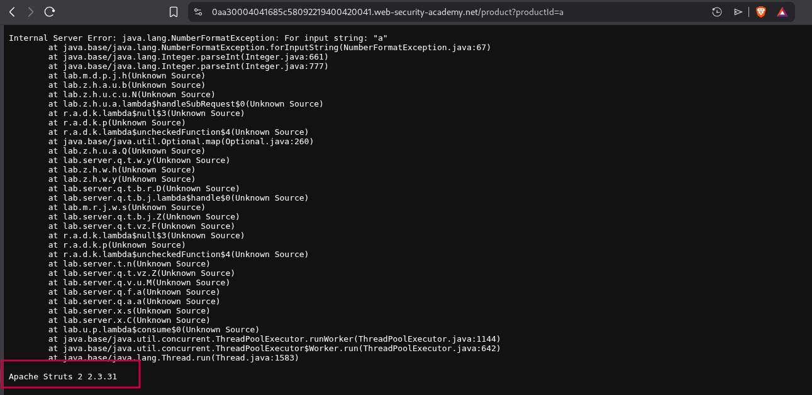
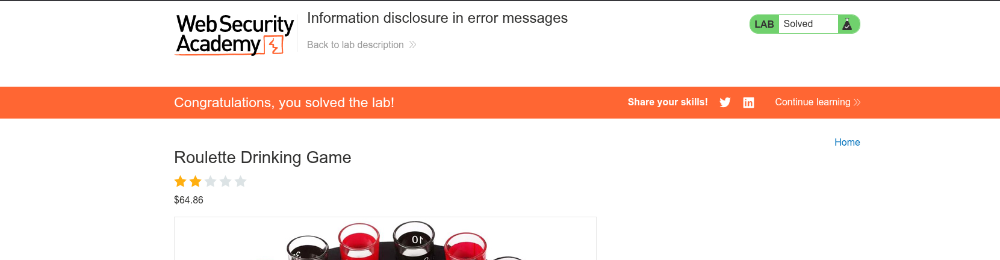

# Information disclosure in error messages

- **Platform**: [Portswigger](https://portswigger.net/web-security/information-disclosure/exploiting/lab-infoleak-in-error-messages)
- **Difficulty**: APPRENTICE
- **Vulnerability**: Information disclosure
- **Date Solved**: 2025-09-28
- **Author**: Ammar Sabit ([Zer0DayDreamer](https://medium.com/@Zer0DayDreamer))

## Lab Overview

- This lab requires exploiting a verbose error message to unveil the version of an outdated third-party framework

## Steps to Reproduce

1. **Identify possible information leaking action**
   - First, we need to find a way to supply an unexpected value type. E.g. a string where an integer is expected; hoping the developer didn't anticipate this and failed to handle it properly.
2. **Navigate through the target**
   - Clicking through the page, we notice that the page uses a query parameter to fetch a specific product `.web-security-academy.net/product?productId=1`
3. **Provide unintended value** - We can make an educated guess that the developer trusted that `productId` will always be `Int`. But he might not have thought of other data types - Changing `productId` to `a` will return `500` Internal Server Error with full stack trace
   

4. **Grab the vulnerable third-party framework version**
   - Here we can easily spot that the application is running `Apache Struts 2 2.3.31`
5. **Submitting the version number marks the lab as solved**
   

## Impact

- With this kind of information leakage, the attacker can further enumerate dependencies and find known vulnerabilities
- In our case with a simple Google search, we can confirm that Apache Struts 2.3.31 is affected by a known Remote Code Execution (RCE) vulnerability: CVE-2017-5638 (S2-045).

## Prevention

- Always return generic error messages
- Add fallback handling for unexpected user input
- **NEVER** trust user input
