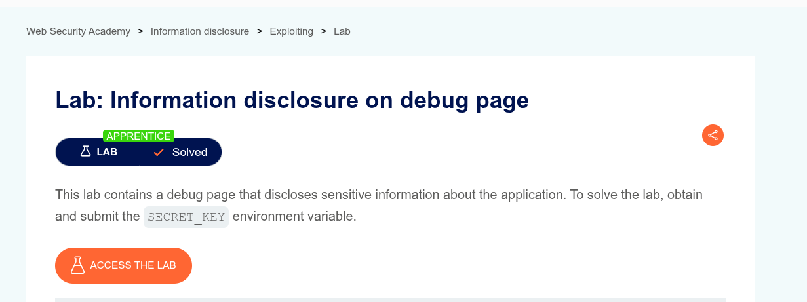
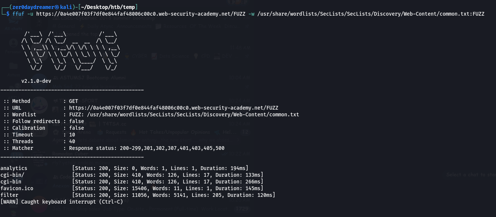
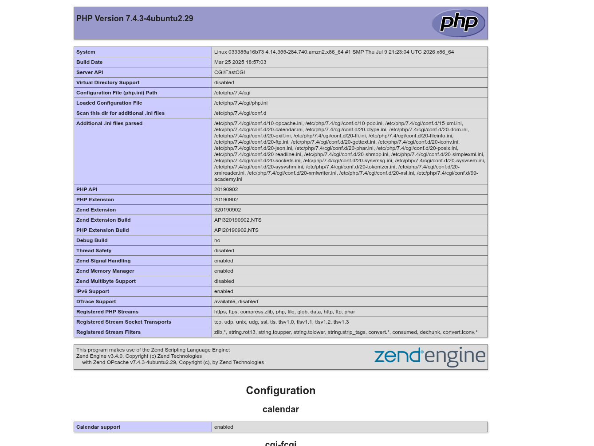
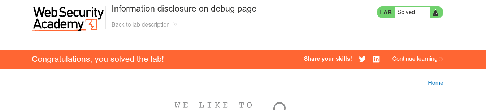

# Information disclosure on debug page

- **Platform**: [Portswigger](https://portswigger.net/web-security/information-disclosure/exploiting/lab-infoleak-on-debug-page)
- **Difficulty**: APPRENTICE
- **Vulnerability**: Information disclosure
- **Date Solved**: 2025-09-30
- **Author**: Ammar Sabit ([Zer0DayDreamer](https://medium.com/@Zer0DayDreamer))

## Lab Overview

- This lab requires finding a debug page that exposes hardcoded sensitive information

## Steps to Reproduce

1. **Directory bruteforce**
   - The lab description tells us that there is a debug page. To find this page we need a directory bruteforcing tool such as `gobuster`, `ffuf` or `dirbuster` and a wordlist
   - I will use `ffuf` as it is easy to use, fast and my favorite tool
2. **Bruteforce directory with `ffuf`**
   - Using the `common.txt` wordlist from `seclists` we can bruteforce the unknown page with ffuf
   
3. **Spot the `cgi-bin` page** 
    - From the `ffuf` result we can see that it found some pages and directories. One of them is `cgi-bin`
    - Browsing to `/cgi-bin` we find `phpinfo.php`

4. **phpinfo.php**

   - This page is hosting PHP's built-in `phpinfo()` function, a diagnostic page that dumps the entire PHP configuration for the server it's running on
5. **Search for `SECRET_KEY`**
   - By pressing `Ctrl+F` we can search for the required string
6. **Submit the value of `SECRET_KEY`**
- Submitting the value we found in the `phpinfo` page marks the lab as solved 

## Impact

- Publicly exposed `phpinfo()` page gives the attacker full PHP configuration, including version, paths and loaded modules
- Environment variables leaked on this page can expose hardcoded secrets such as API keys or database credentials
- Knowing the exact PHP version lets an attacker check for known CVEs affecting it

## Prevention

- Never leave `phpinfo()` or similar diagnostic pages accessible in production
- Restrict debug pages by IP allowlisting or authentication if needed for internal use
- Never hardcode secrets in environment variables exposed through debug output; use a secrets manager instead