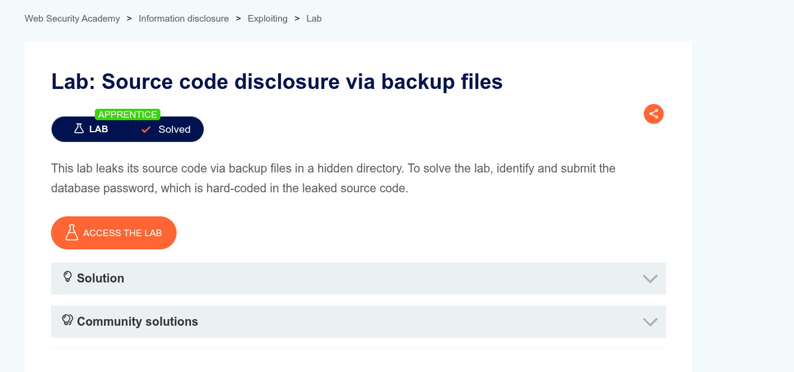
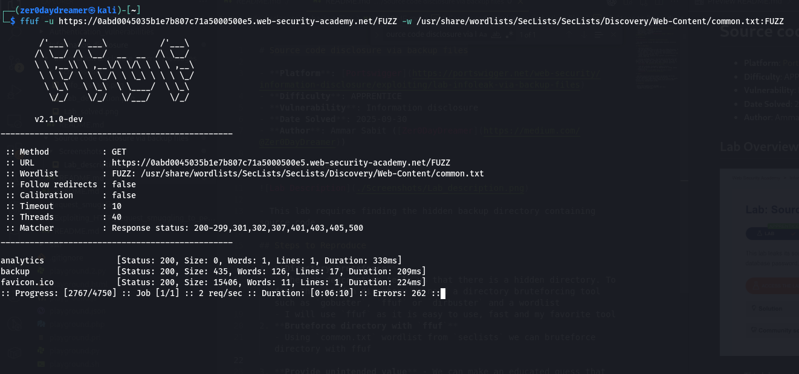
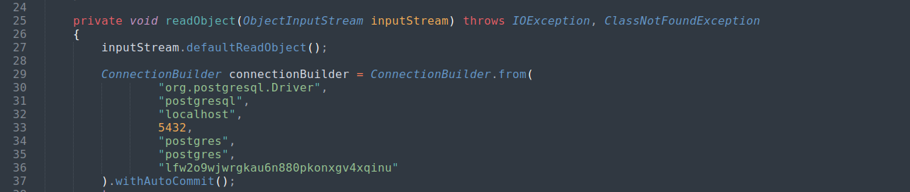
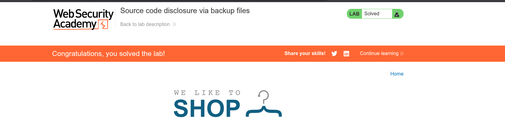

# Source code disclosure via backup files

- **Platform**: [Portswigger](https://portswigger.net/web-security/information-disclosure/exploiting/lab-infoleak-via-backup-files)
- **Difficulty**: APPRENTICE
- **Vulnerability**: Information disclosure
- **Date Solved**: 2025-09-30
- **Author**: Ammar Sabit ([Zer0DayDreamer](https://medium.com/@Zer0DayDreamer))

## Lab Overview

- This lab requires finding the hidden backup directory containing source code

## Steps to Reproduce

1. **Directory bruteforce**
   - The lab description tells us that there is a hidden directory. To find this hidden directory we need a directory bruteforcing tool such as `gobuster`, `ffuf` or `dirbuster` and a wordlist
   - I will use `ffuf` as it is easy to use, fast and my favorite tool
2. **Bruteforce directory with `ffuf`**
   - Using the `common.txt` wordlist from `seclists` we can bruteforce the directory with ffuf
   
3. **Spot the `backup` directory** 
    - From the `ffuf` result we can see that it found some directories. One of them is `backup`
    - Although this directory name is easily guessable, in a real world engagement we should consider using a larger wordlist to unveil hidden directories

4. **Navigate to `backup` directory**
   - Navigating to this directory we just unveiled, we can see there is a file named `ProductTemplate.java.bak`
   - We can use `wget` to download it from the `cli`
   - Running the `file` command on it we can see that it is `Java source, ASCII text`
5. **Read the file with a text editor**
   - We can open the file with our favorite text editor. I will use `Sublime Text` 
   - We can spot that the application is connecting to a postgres database with hardcoded credentials
   
6. **Submit the database password**
- Submitting the database password we found hardcoded in the backup source code marks the lab as solved

## Impact

- Exposing backup directories publicly gives the attacker a bigger attack surface
- Having access to the source code, the attacker can make tailored attacks
- Access to sensitive credentials exposed due to publicly available backup files is a gold mine for threat actors  

## Prevention

- Never keep backup files in a publicly accessible directory, no matter how obscure the name might be 
- Never hardcode credentials in source code; instead use environment variables
- Implement rate limiting to make directory brute forcing harder and slower